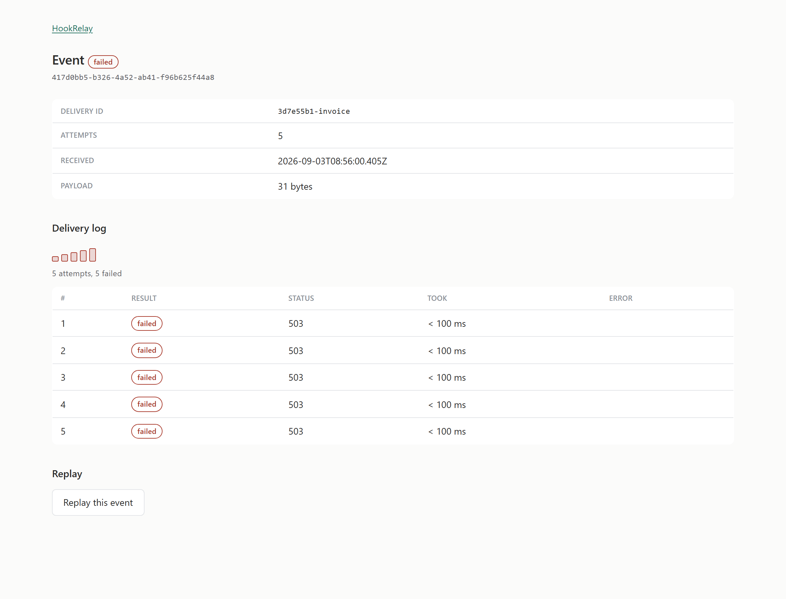

# HookRelay

Reliable webhook delivery. It accepts events, stores them, and keeps retrying until they
land, with a log of every attempt and a dead-letter queue for the ones that never do.



## Why

GitHub POSTs an event to your server once and, in their words, *"does not automatically
redeliver failed webhook deliveries"*. Your endpoint has ten seconds to answer. Miss it
because you were deploying, and the event is gone with nothing to tell you.

HookRelay sits in the middle. It accepts the event, acknowledges it immediately, and takes
responsibility for getting it delivered.

Tested against real GitHub, not only a local harness: a webhook pointed at a tunnel, GitHub
signing a 7.4 KB payload with the endpoint's secret, HookRelay verifying that signature and
answering 202.

## Running it

Needs Node 24+ and Docker.

```sh
cp .env.example .env          # then set API_KEY to something long
npm install
docker compose up -d --wait
npm run migrate:up
npm run dev
```

Create an endpoint and get its ingest URL:

```sh
curl -sX POST localhost:3000/endpoints \
  -H "authorization: Bearer $API_KEY" -H 'content-type: application/json' \
  -d '{"name":"github","destinationUrl":"https://your-app.example/hooks"}'
```

That returns a signing secret, once. Paste the ingest URL into a provider's webhook
settings and the secret into its secret field. The dashboard is at `/dashboard`, using the
same API key as the password.

To run everything in containers instead: `docker compose --profile app up -d --wait`.

## What is interesting here

**Containing SSRF.** Making an HTTP request to a URL somebody else chose is the definition
of server-side request forgery, so the whole design question is what stops it reaching
cloud metadata or an internal service. The address is validated at the moment of
connection rather than when it is saved, because a hostname that resolves publicly when
you check it can resolve to `127.0.0.1` when you connect. There is a test for each bypass
class, including the three ways IPv6 can smuggle an IPv4 address. See
[docs/threat-model.md](docs/threat-model.md).

**Measuring head-of-line blocking.** One destination that accepts connections and never
answers held every worker slot, and unrelated endpoints waited about a hundred times
longer. Adding a circuit breaker did more than speed that up: the delay stopped growing
with the backlog at all, staying flat from 40 queued deliveries to 240. Numbers, method
and the things that were predicted rather than measured are in
[docs/findings.md](docs/findings.md).

## Design notes

Postgres owns the retry policy and Redis only holds what is imminent, because BullMQ
freezes retry options into a job at enqueue time and offers no way to change them
afterwards.

Payloads are stored as raw bytes rather than parsed JSON. A provider signs the exact bytes
it sent, so re-serialising would mean no stored event could ever be verified or replayed.

Attempt numbers climb forever while the retry ladder resets, so replaying a dead-lettered
event cannot collide with the attempts already in its log.

## Limitations

Signatures are mandatory, so a provider that does not sign cannot be relayed. The
idempotency key travels in a header while the signature covers only the body, which leaves
a replay window no receiver can close. One event goes to one destination; fan-out is not
built.

## Commands

| | |
| --- | --- |
| `npm run dev` | run with reload |
| `npm test` | 210 tests, needs the database up |
| `npm run typecheck` | types only |
| `npm run migrate:up` / `:down` | apply or roll back migrations |
| `npm run bench:hol` | reproduce the head-of-line measurement |
